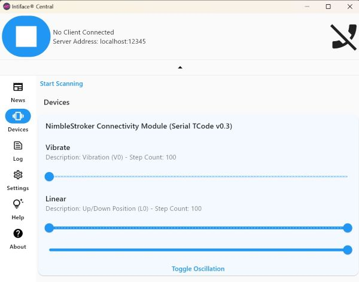
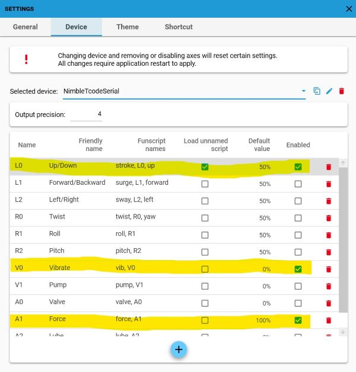
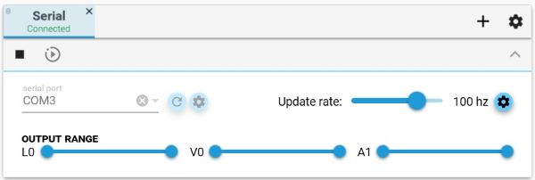

# NimbleTCodeSerial

A [Toy Code (T-Code) v0.3](https://github.com/multiaxis/tcode-spec) compatible Serial Port firmware implementation for the [NimbleConModule](https://shop.exploratorydevices.com/product/connectivity-module-dev-kit/) controller for the [NimbleStroker](https://shop.exploratorydevices.com/).

## TCode Information

- `D0` - Identity device and firmware version: `NimbleStroker_TCode_Serial_v0.3`
- `D1` - Identify TCode version: `TCode v0.4`
- `D2` - List available axes and user range preferences:
  - `L0 0 9999 Up`: **Up/down position** linear motion (default: `5000`)
    - Maps to NimbleStroker positions: -750 to 750
  - `V0 0 9999 Vibe`: **Vibration intensity** (default: `0`)
    - An oscillation is applied to the position when sent to the NimbleStroker.
    - Maps to the amplitude of oscillation: 0 to 25 (position units)
  - `A0 0 9999 Air`: **Auxilliary air in/out valve** (default `5000`)
    - Value `0000` = air-out valve (looser)
    - Value `5000` = stop valve (default)
    - Value `9999` = air-in valve (tighter)
  - `A1 0 9999 Force`: **Force command** (default `9999`)
    - Maps to NimbleStroker force command values: 0 to 1023
    - Controls the air pressure force of the actuator(?)
  - `A2 0 9999 VibSpeed`: **Vibration speed** (default: `9999`)
    - Maps to an oscillation speed for vibration: 0 to 20hz (default 20hz)

Other info:

- Sending live control values to an axis will ease to the target value over multiple frames rather than jump immediately when the difference in change is large (> 100 t-code units, or >50 position units). This is intended to protect the user and device. ([Source1](https://github.com/mnh86/NimbleTCodeSerial/blob/6ab66638b2670115e770fdee9d2ec5c7b04f9390/include/TCodeAxis.h#L217-L228), [Source2](https://github.com/mnh86/NimbleTCodeSerial/blob/6ab66638b2670115e770fdee9d2ec5c7b04f9390/src/main.cpp#L104-L111))
- Up/down position axis values that are sent to the NimbleStroker are set as (-750 to 750) instead of the full [documented range of (-1000 to 1000)](https://github.com/ExploratoryDevices/NimbleConModule/blob/main/README.md?plain=1#L25) to avoid piston damaging the actuator (slamming occurs at min/max ranges). This aligns with max/min values that the NimbleStroker Pendant sends to the actuator, from analysis of debug logging.

## Usage

1. Install [Windows Virtual COM Port (VCP) drivers](https://github.com/mnh86/NimbleConModule/blob/feat/docs/docs/setup-guide-windows-arduino-ide1.md#install-windows-virtual-com-port-vcp-drivers) for the USB/serial connection to the module.
2. Set up [VSCode with PlatformIO](https://randomnerdtutorials.com/vs-code-platformio-ide-esp32-esp8266-arduino/)
3. Clone this repo and open the project in VSCode
4. Build and upload this program into the NimbleConModule
5. Attach the NimbleConModule to the actuator (Label A)
   - Note: Pendant connection not supported
6. Long press the Encoder Dial (2 seconds) to stop commands to the actuator
7. Double press the Encoder Dial to resume sending commands to the actuator
8. Open the PlatformIO Serial Monitor. Enter a TCode command (ie. `D2`) to test.

## Testing with Intiface® Central

On Windows with [Intiface Central](https://intiface.com/central/) installed...

1. Open the Intiface config file: `C:\Users\(User)\AppData\Roaming\com.nonpolynomial\intiface_central\config\buttplug-device-config.json`
2. Find the [JSON block for `tcode-v03`](https://github.com/buttplugio/buttplug/blob/9159c402d866161d55363aad23626df6c006e518/buttplug/buttplug-device-config/buttplug-device-config.json#L4183-L4208). Change the `port` to the one with your attached NimbleConModule, and add a `ScalarCmd` for the vibration parameter. ie:
   ```
   ...
   "tcode-v03": {
      "serial": [
        {
          "port": "COM3",
          "baud-rate": 115200,
          "data-bits": 8,
          "parity": "N",
          "stop-bits": 1
        }
      ],
      "defaults": {
        "name": "NimbleStroker Connectivity Module (Serial TCode v0.3)",
        "messages": {
          "LinearCmd": [
            {
              "StepRange": [
                0,
                100
              ],
              "ActuatorType": "Position",
              "FeatureDescriptor": "Up/Down Position (L0)"
            }
          ],
          "ScalarCmd": [
            {
              "StepRange": [
                0,
                100
              ],
              "ActuatorType": "Vibrate",
              "FeatureDescriptor": "Vibration (V0)"
            }
          ]
        }
      }
    },
    ...
    ```
3. Launch the [Intiface Central](https://intiface.com/central/) application.
4. Under `Settings -> Device Managers`, toggle on `Serial Port`.
5. Click the `Start Server` Icon (top left) to start the server.
6. Under `Devices` click `Start Scanning`...
7. A new device should show up with the name configured in the JSON file.
8. Click the `Toggle Oscillation` button and watch the NimbleConModule LEDs spin.



## Testing with MultiFunPlayer

1. Launch the [MultiFunPlayer](https://github.com/Yoooi0/MultiFunPlayer) application.
2. In the Output section, add a "Serial" device (plus sign).
3. Set the serial port to your COM port value (ie. "COM3").
4. Test the connection with the play button.
5. (Optional) To configure additional axes (L0, V0, A0, A1, A2) for multi script support...
6. Open the Output Configuration panel.
7. Clone the `TCode-0.3 (default)` config, name it `NimbleTcodeSerial`.
8. Enable the channels you'd like to use. ie.:
   - `L0` Up/Down (Select "Load unnamed script") - Default value: `50%`
   - `V0` Vibrate - Default value: `0%` (off state)
   - `A0` Valve - Default value: `50%` (off state)
   - `A1` Force (can rename) - Default value: `100%` (max)
   - `A2` Vibspeed (can rename) - Default value: `100%` (max)
9. See screenshots below.





## Attributions

- Utilized examples from: <https://github.com/tyrm/nimblestroker/>
- Modified NimbleConSDK from: <https://github.com/ExploratoryDevices/NimbleConModule>
- Includes (with minor mods): https://github.com/Dreamer2345/Arduino_TCode_Parser
- See also [platformio.ini](./platformio.ini) for other 3rd party OSS libraries used in this project
- @qdot on the [Buttplug.io Discord](https://discord.gg/h28chsBD) for support
